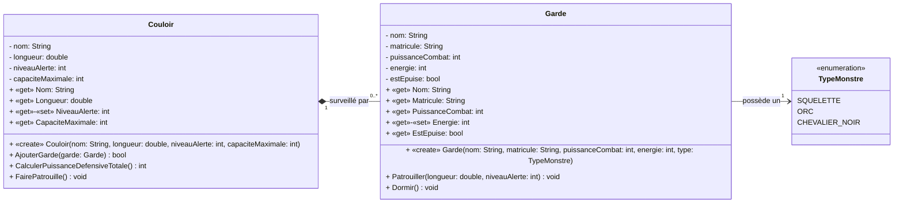

# Projet "DUNGEON-GUARD 3000"

## Le Contexte
Le Seigneur Noir **Malphas** en a assez que des héros entrent dans son donjon comme dans un moulin. Il vous commissionne pour créer le système de gestion de sa Garde de Porte. Il veut automatiser la surveillance des couloirs et la gestion de ses monstres de garde.  

## Cahier des Charges

### Les Couloirs
Chaque couloir possède :  
- Un **nom** (ex: "Couloir des Soupirs")  
- Une **longueur** en mètres  
- Un **Niveau d'Alerte** (un chiffre de 1 à 5)  
- Une **capacité maximale** de gardes  

### Les Gardes
Un garde possède :  
- Un **nom**  
- Un **matricule**  
- Une **Puissance de Combat**  
- Une **Énergie** (maximum 100)  
- Un **Type de Monstre** (Squelette, Orc, Chevalier Noir)  
- Un état **Épuisé** (booléen)  

### Les Règles du Donjon
1. **Affectation** : On assigne des gardes à un couloir. On ne peut pas dépasser la capacité maximale du couloir.  
2. **Patrouille** : Lors d'une patrouille, un garde consomme de l'énergie selon la formule :  
   `EnergiePerdue = LongueurDuCouloir * NiveauAlerte`  
3. **Sécurité** : Si l'énergie d'un garde tombe à 0, il devient "Épuisé". Un garde épuisé ne peut plus patrouiller et sa puissance de combat tombe à 0 (sauf exception).  
4. **Logique de Défense** : La puissance défensive totale d'un couloir est la somme des puissances de tous les gardes **non-épuisés** présents.  

!!! info "Le Petit Plus (Optionnel)"  
    Les **Chevaliers Noirs** ne deviennent jamais "Épuisés", même à 0 d'énergie, mais leur puissance est divisée par 2 quand ils sont fatigués (énergie à 0).  

## Modélisation UML

Voici le diagramme de classes représentant la structure du système :  

## Mission

### Objectif
Concevoir le module `Donjon.Securite`.  

### Instructions
1. **Encapsulation Stricte** : Aucun attribut ne doit être public.  
2. **Validation** : Le `NiveauAlerte` doit être validé à l'entrée (entre 1 et 5).  
3. **Logique Métier** : Implémentez la méthode `FairePatrouille()` qui met à jour l'énergie de tous les gardes du couloir.  

## Test de Validation
Pour vérifier votre implémentation, suivez ce scénario :  
1. Créez un couloir de **20m** avec un niveau d'alerte de **3**.  
2. Ajoutez un **Squelette** (Puissance 10, Énergie 50).  
3. Faites patrouiller le garde une fois via `FairePatrouille()`.  
    - Il perd 60 d'énergie (20 x 3).  
    - Son énergie tombe à 0 et il devient **épuisé**.  
4. Vérifiez que la **Puissance Défensive Totale** du couloir est maintenant de **0** via `CalculerPuissanceDefensiveTotale()`.  
