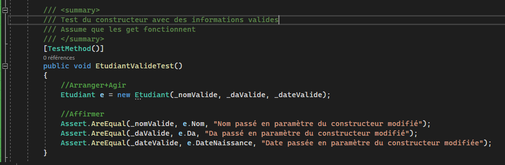

# Création des tests unitaires  

- Pour commencer la création de vos tests, ouvrez le menu des "Actions rapides et refactorisations" (Ctrl + .) en plaçant votre curseur sur le nom de la classe que vous souhaitez tester.  
- Sélectionnez l'option "Créer des tests unitaires" pour lancer l'assistant de configuration.  
  
*Figure 14 : Accès à l'outil de génération de projet de test directement depuis le code source.*  

- Si votre solution ne contient pas encore de projet de tests, conservez les options par défaut proposées par Visual Studio pour en créer un nouveau automatiquement.  
  
*Figure 15 : Configuration initiale du projet de test unitaire.*  

- Prenez le temps de documenter la classe de test avec une section `
`.  
- Déclarez des variables de classe (champs) pour stocker des données de test réutilisables, ce qui simplifiera grandement l'écriture de vos méthodes.  
- Pour chaque constructeur ou méthode, identifiez tous les points de sortie possibles (exceptions levées ou valeurs de retour) et créez une méthode de test dédiée pour chacun.  
- L'utilisation de variables prédéfinies rend le code de test beaucoup plus lisible et rapide à maintenir.  
  
*Figure 16 : Structure d'une classe de test propre avec des variables de préparation et une documentation adéquate.*  

- Pour tester les cas d'erreur, vous pouvez utiliser `Assert.ThrowsException`. Il est recommandé de formater cet appel sur plusieurs lignes pour en faciliter la lecture.  
- L'approche consiste à affirmer qu'une exception spécifique sera lancée lors de l'exécution d'une action précise, tout en fournissant un message clair en cas d'échec du test.  
  
*Figure 17 : Syntaxe recommandée pour tester la levée d'exceptions avec un message d'erreur explicite.*  

- Pour un test de succès (cas nominal), vérifiez que l'objet est correctement instancié et que ses propriétés correspondent aux valeurs attendues.  
  
*Figure 18 : Validation finale d'une instanciation réussie garantissant l'intégrité de l'objet créé.*