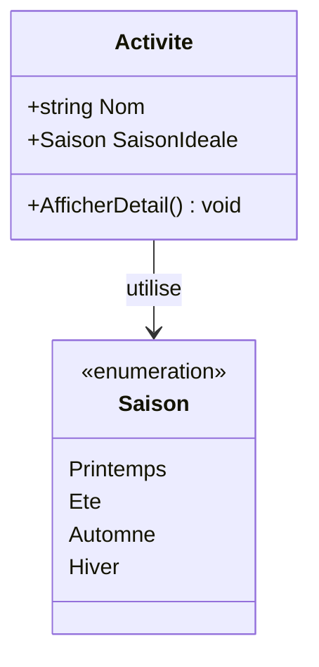

# Les Énumérations (Enums)

Une énumération (`enum`) est un type de données spécial qui permet de définir un ensemble de constantes nommées. Elle est utilisée pour représenter un choix parmi une liste fixe de possibilités, rendant le code plus lisible et moins sujet aux erreurs que l'utilisation de simples nombres ou chaînes de caractères.

## Déclaration de base

Par défaut, une énumération commence à 0 et s'incrémente de 1 pour chaque élément.

```csharp
public enum JourSemaine
{
    Lundi,
    Mardi,
    Mercredi,
    Jeudi,
    Vendredi,
    Samedi,
    Dimanche
}
```

## Déclaration avec valeurs spécifiques

Il est possible d'assigner des valeurs entières spécifiques aux éléments de l'énumération. Si aucune valeur n'est spécifiée pour un élément, il prend la valeur du précédent + 1.

```csharp
public enum CodeErreur
{
    Aucun = 0,
    Inconnu = 100,
    AccesRefuse = 403,
    NonTrouve = 404
}
```

## Utilisation et organisation des fichiers

Lorsqu'une énumération doit être utilisée dans plusieurs classes, il est **fortement recommandé** de la placer dans son propre fichier `.cs`. Cela facilite la maintenance et la visibilité du code.

### Règle d'or : Un fichier par Enum
Si votre énumération est utilisée par plus d'une classe, créez un fichier portant exactement le nom de l'énumération.

**Fichier : `Saison.cs`**
```csharp
namespace MonApplication.Modeles
{
    /// <summary>
    /// Représente les quatre saisons de l'année.
    /// </summary>
    public enum Saison
    {
        Printemps,
        Ete,
        Automne,
        Hiver
    }
}
```

### Exemple d'utilisation dans une autre classe

**Fichier : `Activite.cs`**
```csharp
namespace MonApplication.Modeles
{
    public class Activite
    {
        public string Nom { get; set; }
        // Utilisation de l'enum Saison définie dans Saison.cs
        public Saison SaisonIdeale { get; set; }

        public void AfficherDetail()
        {
            Console.WriteLine($"Activité : {Nom}");
            
            if (SaisonIdeale == Saison.Hiver)
            {
                Console.WriteLine("N'oubliez pas vos skis !");
            }
        }
    }
}
```



## Avantages de l'Enum
1. **Lisibilité** : `Saison.Hiver` est beaucoup plus clair que le chiffre `3`.
2. **Auto-complétion (IntelliSense)** : Visual Studio vous proposera la liste des valeurs possibles dès que vous tapez `=`.
3. **Sécurité** : On ne peut pas assigner accidentellement une valeur qui n'existe pas dans la liste sans forcer une conversion (cast).

## Conversion (Casting)
On peut facilement convertir un `enum` en `int` et vice-versa.

```csharp
// Enum vers int
int valeur = (int)Saison.Ete; // valeur vaudra 1

// int vers enum
Saison maSaison = (Saison)2; // maSaison sera Saison.Automne
```
