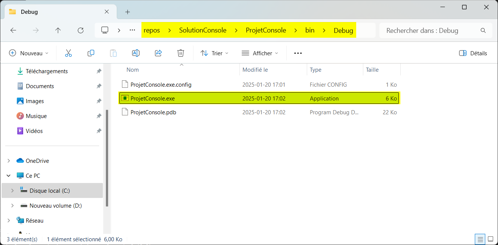
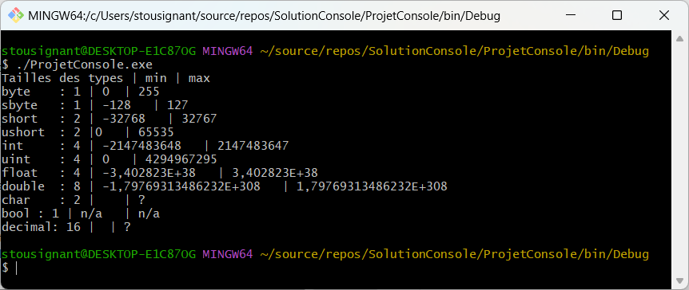
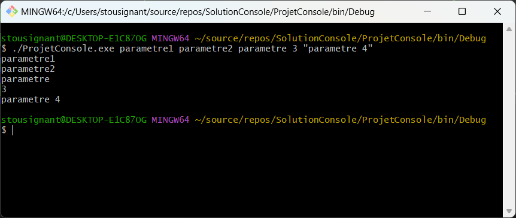
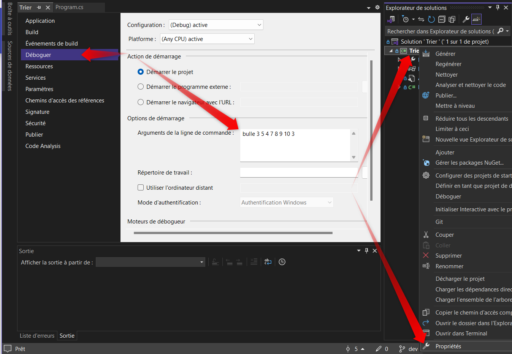
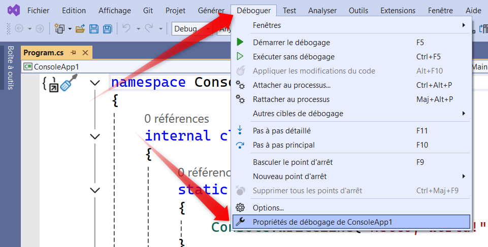
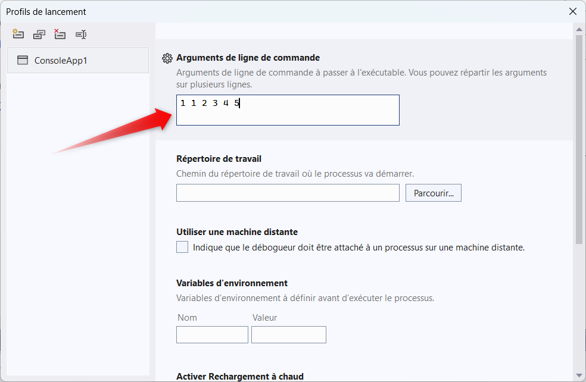

# Révision du cours de programmation 1 et compléments d'information

## Les types de bases

### Entiers

 Type | Nombre d'octets | Minimum | Maximum | Notes 
 --|--|--|--|--
 short | 2 octets | -32768 | 32767 |
 ushort | 2 octets | 0 | 65535 |
 int | 4 octets | -2 147 483 648 | 2 147 483 647 |
 uint | 4 octets | 0 | 4 294 967 295 |
 long | 8 octets | 9 223 372 036 854 775 808 | 9 223 372 036 854 775 807 |
 ulong | 8 octets | 0 | 18 446 744 073 709 551 615 |


### Virgules
 Type | Nombre d'octets | Minimum | Maximum | precision 
--|--|--|--|--
float | 4 octets | ±1.5 x 10^−45 | ±3.4 x 10^38	| ~6-9 nombres 	
double | 8 octets | ±5.0 × 10^−324 | ±1.7 × 10^308 | ~15-17 nombres 
decimal | 16 octets | ±1.0 x 10^-28 | ±7.9228 x 10^28 | 28-29 nombres 
   
### Logiques
 Type | Nombre d'octets | Valeurs
 --|--|--
 bool | 1 octet | true/false	

### Textuels
 Type | Nombre d'octets | Notes
 --|--|--
 char | 2 octets | 1 caractère | Valeurs de 0 à 65 535 | 
 string | 0 à 2,147,483,647 x 2 octets (char) |  2 147 483 647 caractères

### Binaires
 Type | Nombre d'octets | Notes
 --|--|--
 byte | 1 octets | Valeurs de 0 à 255
 sbyte | 1 octet | Valeurs de -128 à 127 

### Les tableaux unidimentionnels

### Les tableaux multidimentionnels

### Les tableaux de tableaux

## Les structures de controle

### if

``` c# title="simple if"
if (condition) 
{  
    // Bloc de code à exécuter si la condition retourne "true"  
}  
else if (condition 2)  
{ 
    /* bloc de code 2 */
}
else
{
    /*bloc de code 3*/
}
```

### for


``` c# title="simple for"
   for (affirmation 1; affirmation 2; affirmation 3)  
   {  
      // Bloc de code à exécuter si la condition retourne "true"  
   }  
```
  

* Affirmation 1 est exécuté (une fois) avant l'exécution du bloc de code.  
* Affirmation 2 définie la condition pour que le bloc soit exécuté.  
* Affirmation 3 est exécuté (chaque fois) après que le bloc de code soit exécuté.  

### while

``` c# title="simple while"
   while (condition)  
   {  
      // Bloc de code à exécuter si la condition retourne "true"  
   }  
```

### do while
``` c# title="simple do while"
   do  
   {  
      // Bloc de code à exécuter si la condition retourne "true"  
   } while (condition) 
```
* À noter que la boucle sera toujours exécuté 1 fois au minimum

### foreach

*  En lecture seule seulement, aucune modification de la structure.

``` c# title="foreach - pour toutes les valeurs d'une collection"
   foreach(LeType nomVariable in laCollectionOuLeTableau)
      // Bloc de code à exécuter si la condition retourne "true"  
   }

   int[] lesNombres =  {1, 3, 5 };
   foeach(int leNombre in lesNombres)
   {
      //utilisation de la varibale "leNombre" qui prendra les valeurs de 1, 3 et 5
      Console.WriteLine(leNombre); //affichera 1, 3 et 5 en sautant une ligne
   } 
```
## Visual studio et la compilation
Lorsque visual studion fait la compilation de votre programme, soit par l'exécution, soit simplement par la génération (menu générer) le code est converti en langage intermédiaire (Intermediate language "il")  

Généralement, depuis programmation 1, vous compilez en mode debug.  

Se faisant votre programme sera compilé et assemblé dans le dossier de votre solution sous [dossier de solution]/[dossier de Projet]/bin/debug/  



### Exécution d'une application console via l'invite de commande

On peut démarrer l'application en cliquant dessus, mais également en lancant l'exécutable via l'invite de commande.  

Pour le présent exemple j'ai utilisé "git bash". J'aurais pu utiliser powershell ou encore l'invite de commande standard.



### public static void Main(string[] args) ?

``` c# title="Main"
   public static void Main(string[] args)
   {
      // afficher chacun des paramètres à l'écran
      foreach(string parametre in args)
      {
         Console.WriteLine(parametre);
      }
   } 
```

** notez les choses suivante : **  

- Rien de particulier pour paramètre 1 et 2
- Le paramètre 3 a été coupé en deux à cause de l'espace
- Le paramètre 4 est correct puisqu'il est entre guillemets.



### Déboguage avec visual studio et les paramètres.
On peut lancer l'application dans visual studio en simulant que des paramètres ont été insérés dans l'invite de commande.  
pour se faire, on doit aller dans le menu Déboguer -> Propriétés de déboguage de [projet] -> Arguments de la ligne de commande.  

  
Ou encore dans le menu de déboggage. Par les propriétés du projet.  Les deux sont équivalents.  
  
  

## Exercice de révision p1 + p2 (Utilisation de l'ia ou des travaux de P1 interdit)
0. Faites vous un répertoire git avec un .gitignore pour c#.
Je vous suggère  [celui-ci](https://github.com/github/gitignore/blob/main/VisualStudio.gitignore)  
0.0 Faites vous un dossier pour travailler.  
0.1 Lancez git bash dans le dossier et lancez -> git init  
0.2 Copiez votre fichier .gitignore dans le dossier  
0.3 Faites git add .   
0.4 Faites git commit -m "Premier commit"  
0.5 Ensuite lancez votre visual studio dans le dossier git.  

**Règles pour vos commit. 1 commit par fonctionnalité terminée et testée.**

1. Faites une méthode Afficher() qui prend en paramètre un tableau d'entiers et qui l'affiche à l'écran.
Faites le summary associé.  

2. Faites une méthode qui s'appelle Interchanger qui prends en paramètre un tableau d'entier et 2 nombre entiers.  
Les 2 nombres passés en paramètres sont les 2 index qui doivent être interchangé.

Exemple Interchanger(monTableau, index1, index2);  

Considérant le tableau suivant : 
{ 10, 20, 30, 40, 50 }  
Considérant les index 0 et 3
L'invocation de Interchanger(leTableau, 0, 3) interchange les valeurs à l'index 0 et 3 soit :  

{ 40, 20, 30, 10, 50 }  

Vous avez vu les trois tris suivants:  
- Tri à bulle  
- Tri selection    
- Tri insertion  

Référence : [Visualgo](https://visualgo.net/en/sorting)

Codez 3 méthodes avec leurs noms respectifs. Pouvant trié Avec les summarys tels que demandés.  
<!-- TODO markdown vérifier la suite logique-->
3. Faites la codification de du Main de façon à ce que :  
3.1 S'il n'y a aucun paramètres ou si les paramètres sont invalides, l'application se ferme en disant "Paramètre invalide : la syntaxe doit être...."  
3.2 l'application doit avoir comme premier parametres "bulle", "insertion" ou "selection"  
3.3 l'application doit avoir en dernier parametres une série d'entiers à trier.  
3.4 l'application doit utiliser Interchanger  

Exemple : Trier.exe bulle 5 5 7 8 9 4 5 3 3 10  
Doit afficher :  
> :memo: **Résultat**  
Tri bulle :  
3 3 4 5 5 5 7 8 9 10
---
Exemple : Trier.exe bubulle 5 5 7 8 9 4 5 3 3 10  
ou  
Trier.exe bubulle 5 5 7 8 Roger 4 5 3 3 10  

Doit afficher :  

> :memo: **Résultat**  
Paramètres invalide : la syntaxe doit être Trier.exe [ bulle | insertion | selection ] {nombres...}
---