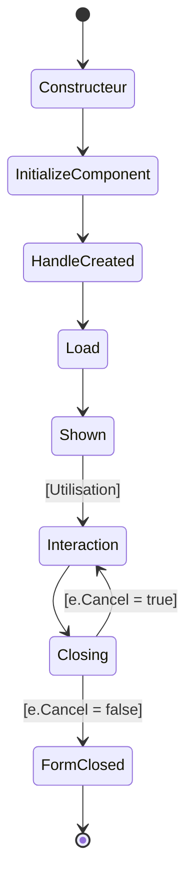
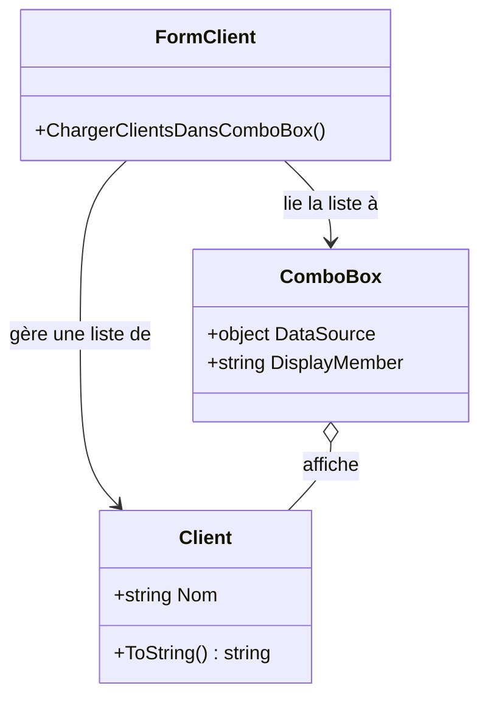

# Cycle de vie d’un Formulaire Windows Forms en C\#

Ce document résume les étapes clés du cycle de vie d’un `Form` dans une application Windows Forms, du constructeur à la fermeture.

---

## 🔄 Ordre des événements principaux

1. **Constructeur**

       - Appelé lors de la création de l’objet.
       - Initialise les composants.
```csharp
public Form1()
{
    InitializeComponent();
}
```


2. **HandleCreated**
 *(optionnel, rarement utilisé)*
       - Déclenché lorsque le handle Windows du formulaire est créé.


3. **Load**

       - Déclenché juste avant que le formulaire soit affiché.
       - Idéal pour charger des données ou initialiser l’interface.
```csharp
private void Form1_Load(object sender, EventArgs e) { }
```


4. **Shown**

       - Déclenché **une seule fois**, lorsque le formulaire devient visible.
       - Utile pour lancer des actions post-affichage.
```csharp
private void Form1_Shown(object sender, EventArgs e) { }
```


5. **[Phase d’interaction]**

       - Événements utilisateur : clics, saisies, navigation, etc.


6. **Closing**

       - Déclenché juste avant la fermeture.
       - Permet d’annuler la fermeture (`e.Cancel = true`).
```csharp
private void Form1_Closing(object sender, CancelEventArgs e) { }
```


7. **FormClosed**

       - Déclenché une fois le formulaire fermé.
       - Idéal pour les nettoyages finaux ou sauvegardes.
```csharp
private void Form1_FormClosed(object sender, FormClosedEventArgs e) { }
```

---

## 🧭 Résumé visuel



---

## ✅ TLDR

- `Load` : préparation avant l'affichage.
- `Shown` : action une fois le formulaire visible.
- `Closing` : pour intercepter la fermeture.
- `FormClosed` : pour terminer proprement.


# Liaison d'une List<Client> à un ComboBox dans Windows Forms

Ce document explique comment, à partir du contrôleur, récupérer une liste de clients (`List<Client>`) et l'assigner à un `ComboBox` dans un formulaire Windows Forms.

---

## 1. Classe `Client` de base

Voici un exemple simple de classe `Client` :

```csharp
public class Client
{
    public string Nom { get; set; }

    public override string ToString()
    {
        return Nom;
    }
}
```



---

## 2. Récupération de la liste depuis le contrôleur

On suppose que le contrôleur a une méthode comme :

```csharp
public List<Client> RecupererListeClient()
{
    return new List<Client>
    {
        new Client { Nom = "Alice" },
        new Client { Nom = "Bob" }
    };
}
```

---

## 3. Liaison au ComboBox (`comboBoxClient`)

Dans le formulaire, on peut lier la liste à un `ComboBox` :

```csharp
private void ChargerClientsDansComboBox()
{
    List<Client> listeClients = _controlleurClient.RecupererListeClient();
    comboBoxClient.DataSource = listeClients;
    comboBoxClient.DisplayMember = "Nom"; // Propriété à afficher
}
```

---

## 4. Appel dans `Form_Load`

Pour remplir le `ComboBox` au chargement du formulaire :

```csharp
private void FormClient_Load(object sender, EventArgs e)
{
    ChargerClientsDansComboBox();
}
```

---

## TLDR

- Le `ComboBox` affiche la propriété `Nom` des objets `Client`.
- La source de données est la liste retournée par le contrôleur.
- Il suffit de définir `DisplayMember` pour contrôler l'affichage.


