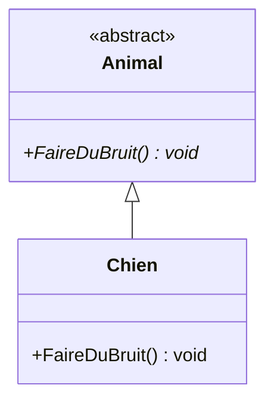
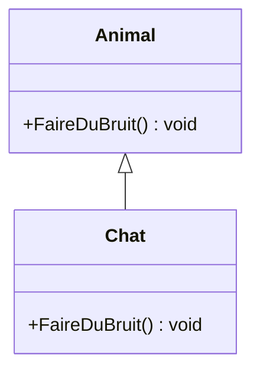
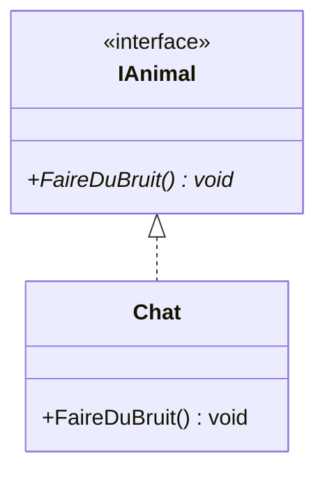
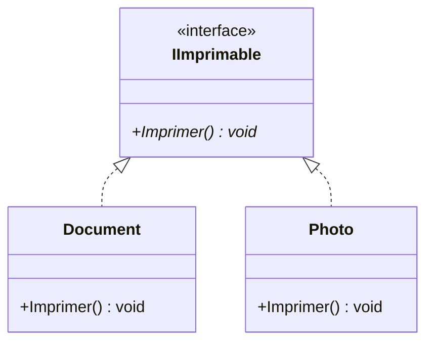
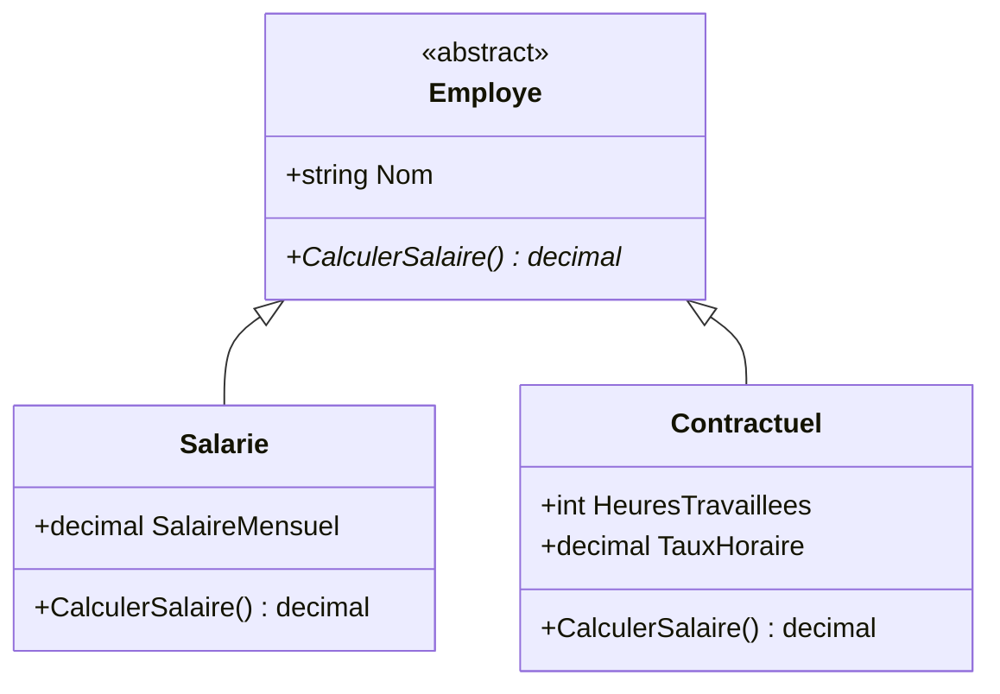

# Concepts OOP en C# : abstract, virtual, sealed, interfaces

## Sommaire

- [1. Mots-clés fondamentaux](#1-mots-cles-fondamentaux)
  - [1.1. abstract](#11-abstract)
  - [1.2. virtual](#12-virtual)
  - [1.3. sealed](#13-sealed)
- [2. Comparaison avec les interfaces](#2-comparaison-avec-les-interfaces)
- [3. Cas d'utilisation recommandés](#3-cas-dutilisation-recommandes)
- [4. Résumé comparatif](#4-resume-comparatif)
- [5. Différence entre une méthode abstraite et une interface](#5-difference-entre-une-methode-abstraite-et-une-interface)

---

## 1. Mots-clés fondamentaux

### 1.1. `abstract`

- **Définition :** Une classe ou une méthode marquée `abstract` est incomplète et doit être implémentée dans une classe dérivée.
- **Usage :** utilisé pour définir des modèles communs, des "templates" de comportement.

```csharp
public abstract class Animal
{
    public abstract void FaireDuBruit();
}

public class Chien : Animal
{
    public override void FaireDuBruit()
    {
        Console.WriteLine("Wouf!");
    }
}
```



🔸 **Note :** Une classe `abstract` ne peut pas être instanciée directement.

### 1.2. `virtual`

- **Définition :** Permet à une méthode dans une classe de base d’être redéfinie (surchargée) dans une classe dérivée.
- **Usage :** utilisé pour fournir un comportement par défaut, tout en laissant la possibilité de le remplacer.

```csharp
public class Animal
{
    public virtual void FaireDuBruit()
    {
        Console.WriteLine("Un bruit animal");
    }
}

public class Chat : Animal
{
    public override void FaireDuBruit()
    {
        Console.WriteLine("Miaou");
    }
}
```



🔸 **Note :** Si une méthode `virtual` n’est pas redéfinie, le comportement par défaut est conservé.

### 1.3. `sealed`

- **Définition :** Empêche qu’une classe (ou une méthode) soit dérivée ou redéfinie.
- **Usage :** utilisé pour des raisons de sécurité, de performance, ou pour figer une implémentation.

```csharp
public sealed class Utilitaire
{
    public void EffectuerTâche()
    {
        Console.WriteLine("Tâche effectuée.");
    }
}

// public class Avancé : Utilitaire ❌ Erreur : sealed = pas de dérivation possible
```

On peut également marquer une **méthode** comme `sealed` dans une classe dérivée :

```csharp
public class Animal
{
    public virtual void FaireDuBruit() => Console.WriteLine("Animal!");
}

public class Chien : Animal
{
    public sealed override void FaireDuBruit() => Console.WriteLine("Wouf!");
}

public class Chiot : Chien
{
    // public override void FaireDuBruit() ❌ Interdit
}
```

---

## 2. Comparaison avec les interfaces

| Élément         | Classe Abstraite            | Interface                        |
|----------------|-----------------------------|----------------------------------|
| Héritage       | Une seule classe de base    | Multiple interfaces              |
| Implémentation | Peut contenir du code       | Depuis C# 8, peut contenir du code par défaut (default interface methods), mais rare. |
| Constructeurs  | Oui                         | Non                              |
| Membre         | Champs, propriétés, méthodes| Seulement méthodes/propriétés    |

**Exemple interface :**

```csharp
public interface IAnimal
{
    void FaireDuBruit();
}

public class Chat : IAnimal
{
    public void FaireDuBruit() => Console.WriteLine("Miaou");
}
```



**Avantages d’une interface :**
- Idéal pour l’héritage multiple (ex. `IAnimal`, `IVolant`).
- Favorise le couplage faible.

**Avantages d’une classe abstraite :**
- Partage de code commun facilité.
- Encapsulation de logique métier partielle.

---

## 3. Cas d'utilisation recommandés

### ➤ Quand utiliser `abstract` ?
- Si vous avez une hiérarchie avec des comportements partagés.
- Si certaines méthodes doivent obligatoirement être redéfinies.
- Ex : `Animal`, `Vehicule`, `Employe`.

### ➤ Quand utiliser `virtual` ?
- Si une méthode a un comportement par défaut, mais peut être personnalisée.
- Ex : `ToString()`, `Equals()` dans .NET.

### ➤ Quand utiliser `sealed` ?
- Pour sécuriser une implémentation.
- Pour empêcher toute extension d’une classe ou d’une méthode.
- Pour optimiser les performances (pas besoin de chercher des overrides au runtime).

### ➤ Quand utiliser une `interface` ?
- Pour définir un contrat sans logique métier.
- Quand plusieurs classes sans lien hiérarchique doivent partager un comportement.
- Ex : `IDisposable`, `IEnumerable<T>`.

---

## 4. Résumé comparatif

| Concept   | Héritage | Implémentation | Objectif principal                      |
|----------|----------|----------------|------------------------------------------|
| abstract | Simple   | Partielle      | Modèle commun avec obligation d’override |
| virtual  | Simple   | Complète       | Comportement personnalisable             |
| sealed   | Simple   | Complète       | Protection de l’implémentation           |
| interface| Multiple | Aucune (ou default)| Définir un contrat                      |

---

## 5. Différence entre une méthode abstraite et une interface

### 📌 Quand utiliser une **interface** ?

Une interface est idéale pour définir un **contrat de comportement** que plusieurs classes sans lien hiérarchique doivent respecter. Elle est utilisée lorsque l’on veut **décrire des capacités**, indépendamment de l’héritage ou de la structure d’objet.

**Exemple :**
```csharp
public interface IImprimable
{
    void Imprimer();
}

public class Document : IImprimable
{
    public void Imprimer()
    {
        Console.WriteLine("Impression du document...");
    }
}

public class Photo : IImprimable
{
    public void Imprimer()
    {
        Console.WriteLine("Impression de la photo...");
    }
}
```



🟢 Ici, `Document` et `Photo` n'ont aucun lien hiérarchique, mais ils partagent tous deux la capacité à être imprimés. Une **interface** est donc la solution naturelle.

---

### 📌 Quand utiliser une **méthode abstraite** ?

Une méthode abstraite s’utilise dans une **hiérarchie de classes** où une classe de base définit un comportement générique, mais impose aux sous-classes d’en fournir une implémentation spécifique.

**Exemple :**
```csharp
public abstract class Employe
{
    public string Nom { get; set; }
    public abstract decimal CalculerSalaire();
}

public class Salarie : Employe
{
    public decimal SalaireMensuel { get; set; }

    public override decimal CalculerSalaire() => SalaireMensuel;
}

public class Contractuel : Employe
{
    public int HeuresTravaillees { get; set; }
    public decimal TauxHoraire { get; set; }

    public override decimal CalculerSalaire() => HeuresTravaillees * TauxHoraire;
}
```



🟢 Ici, tous les employés **sont** des `Employe`, et ils doivent obligatoirement définir comment calculer leur salaire. Une **classe abstraite avec méthode abstraite** s’impose naturellement.

---

### ✅ Résumé

| Cas                                 | Préférer                       |
|-------------------------------------|--------------------------------|
| Classes sans lien hiérarchique      | Interface                      |
| Classes liées par un concept commun | Classe abstraite               |
| Besoin d’un comportement imposé     | Méthode abstraite              |
| Partage de code possible            | Classe abstraite               |
| Flexibilité, extensibilité          | Interface                      |
---