# Création d'une solution multi-projets

Généralement, une solution est composée de plusieurs projets.  
La raison est qu'on ne mélange pas les projets qui font l'interaction avec l'utilisateur  
avec les projets qui sont la logique, le domaine, de l'application.

Généralement on retrouve 3 types de projets.  
- Les projet(s) d'interface avec l'utilisateur -> Console / Graphique  
- Les projets de bibliothèque de classe  
- Les projets de tests unitaires  

Pour bien saisir les 3 types de projet, récapitulons les indices.

- "Ne faites pas de Console.WriteLine partout !"

Effectivement, on veut séparer la logique applicative de la logique d'affichage.  

Prenons par exemple les tris que vous avez fait. Un tableau en désordre en entré,  
un tableau en ordre en sortie. Il est nullement nécessaire d'en faire l'affichage.

Faisons notre premier projet qui contient les 3 projets nécessaires à faire un bon 
développement.   

Avant toute chose, révisez l'onglet installation pour vous assurer que  
vous avez .NET 8 et .NET 9. 

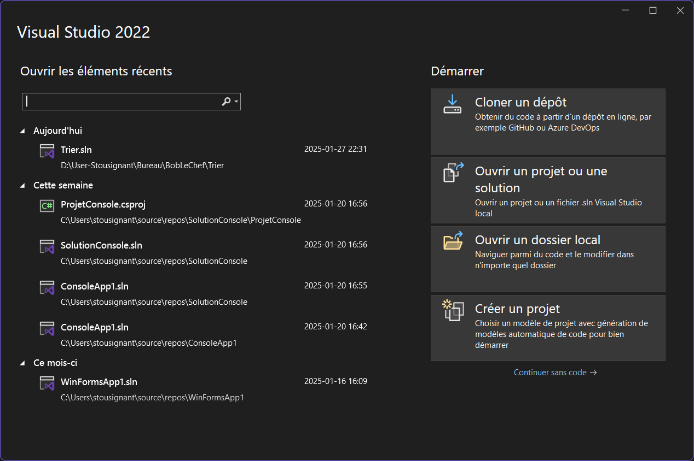
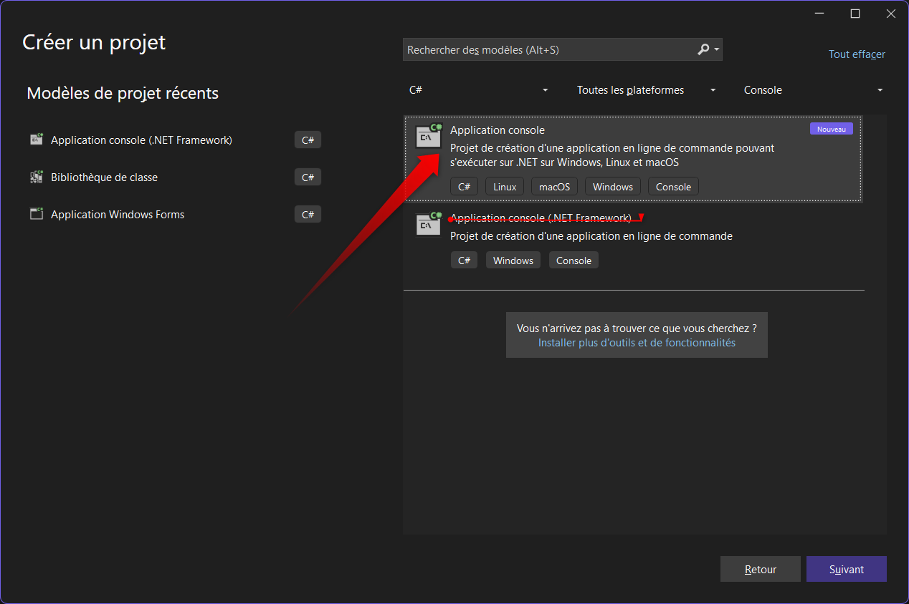  
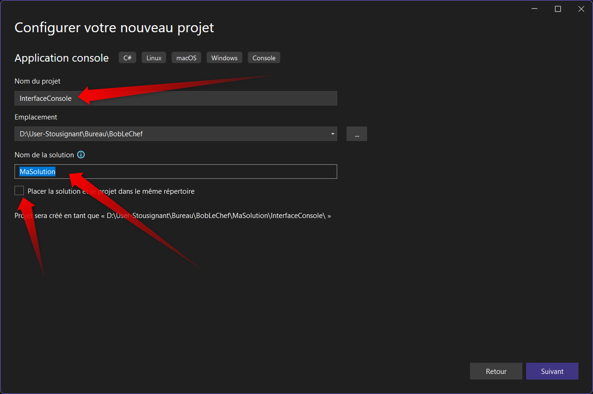  
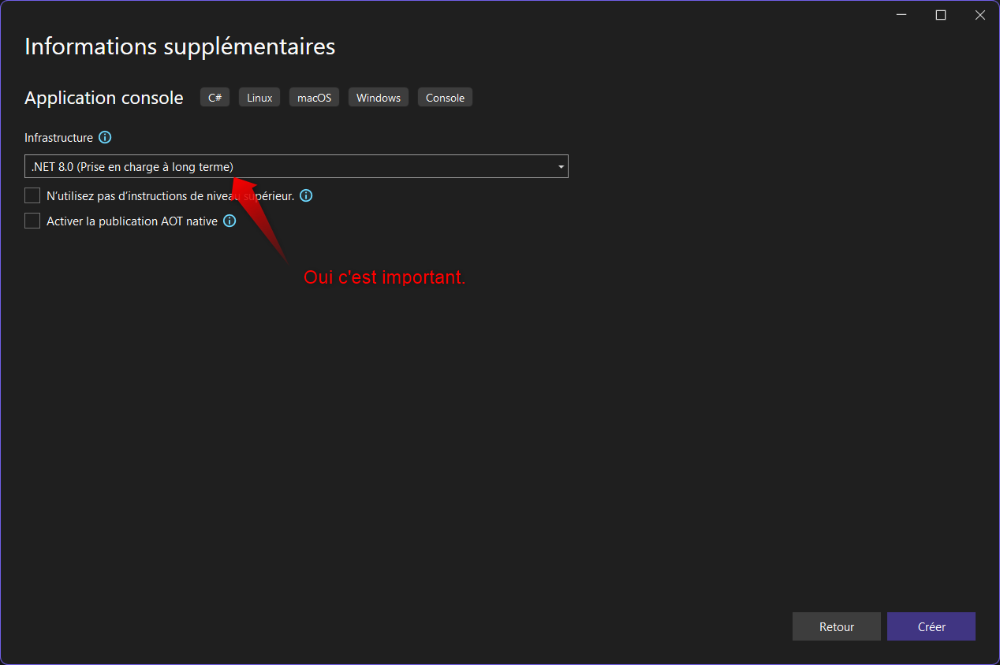  
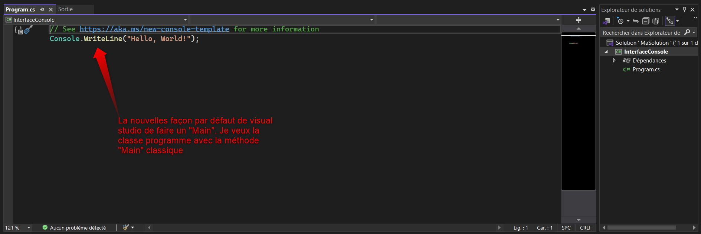  
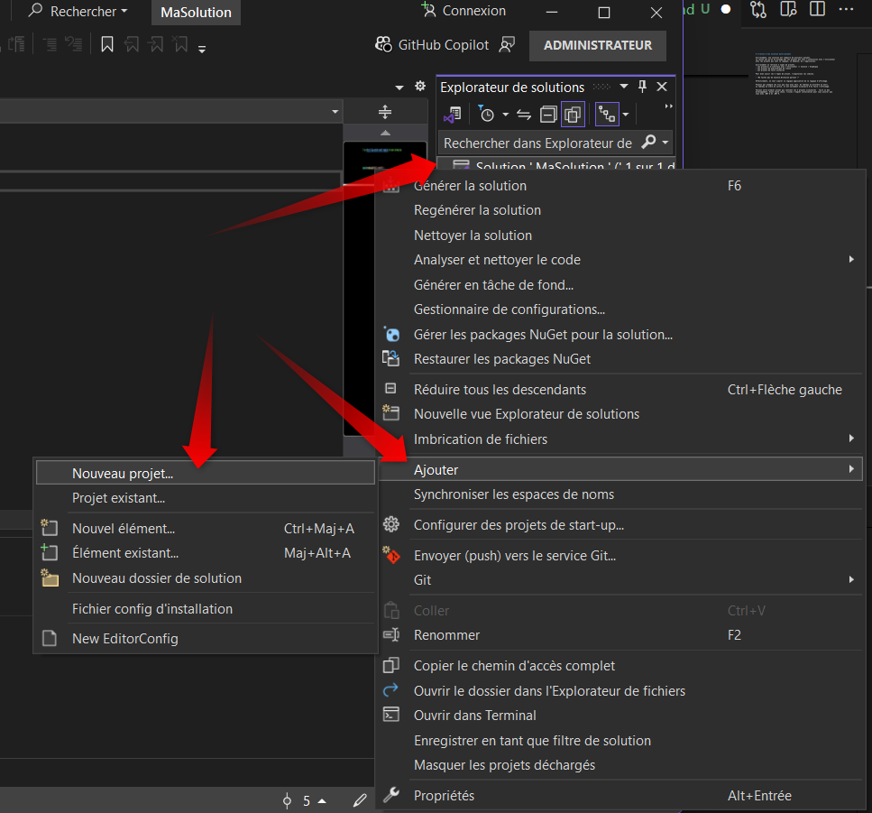  
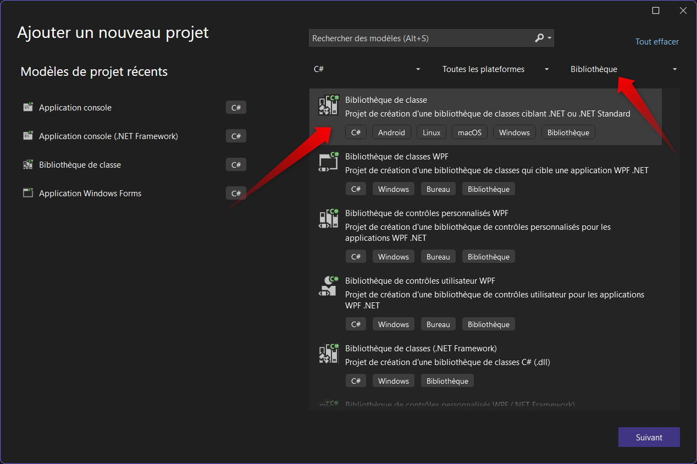  
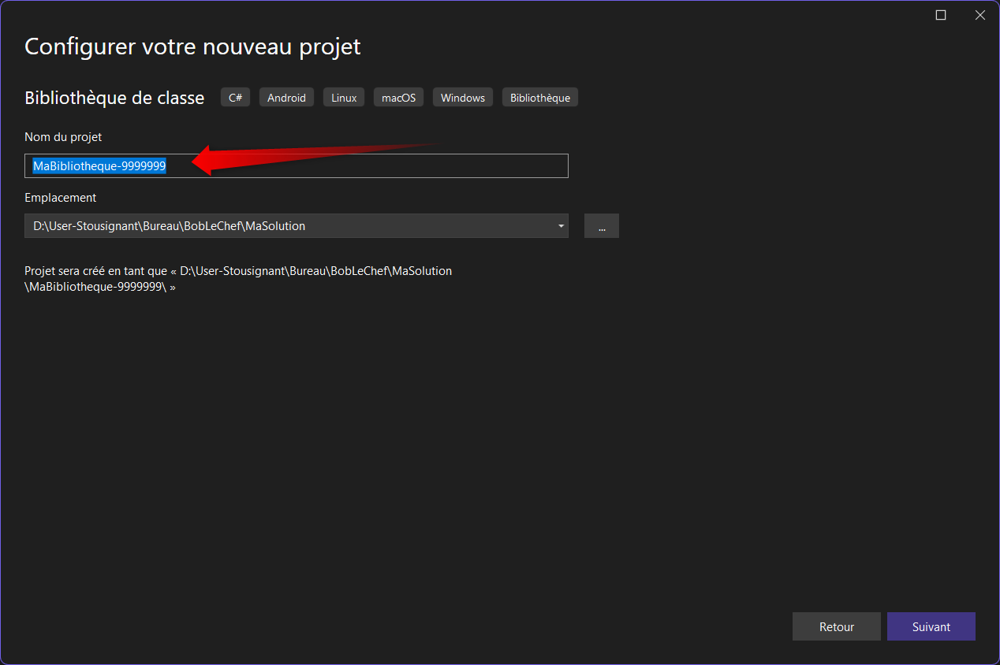  
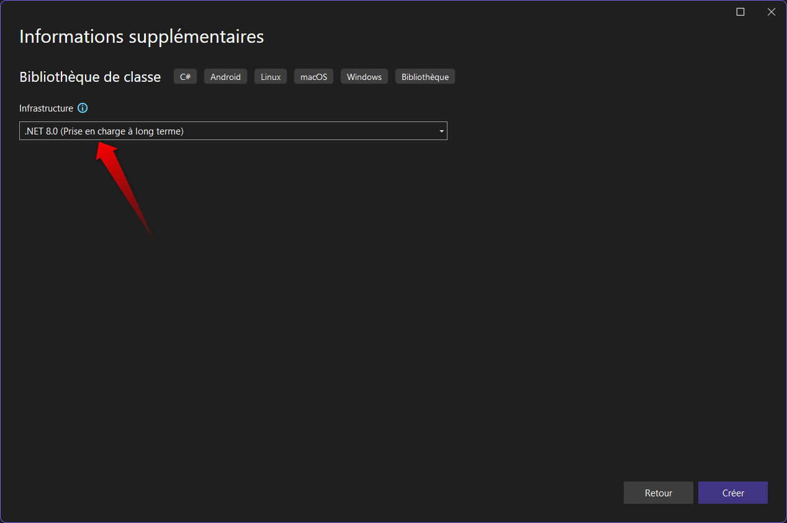  
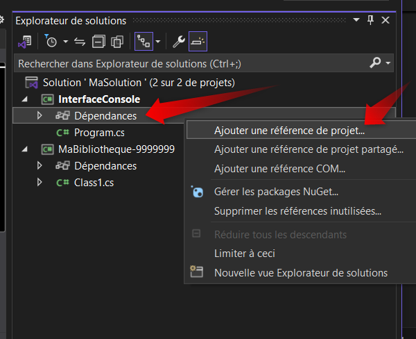  
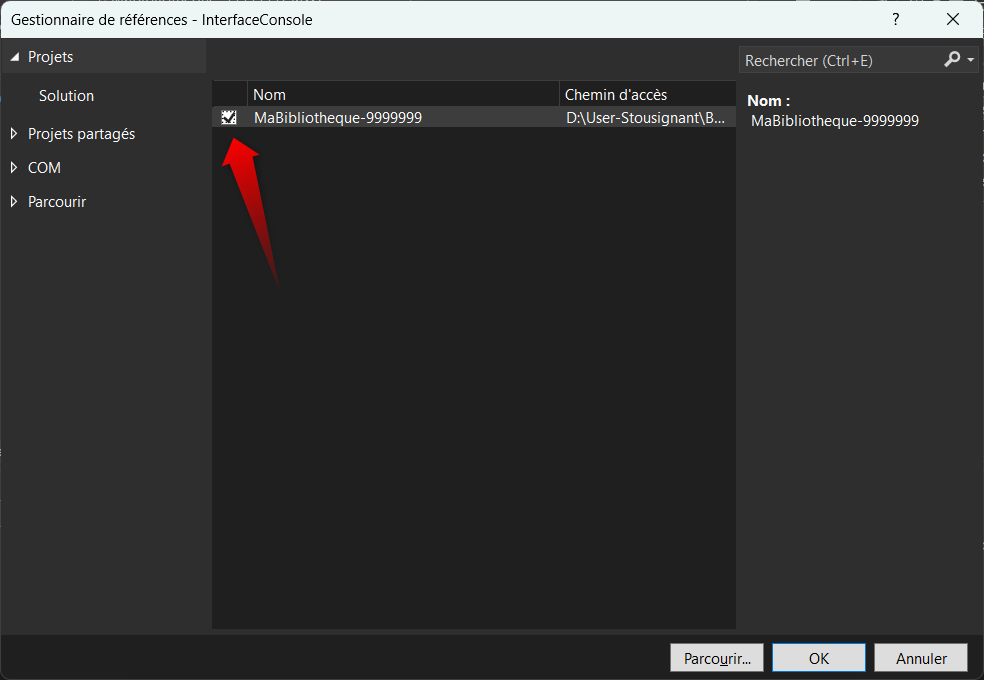  
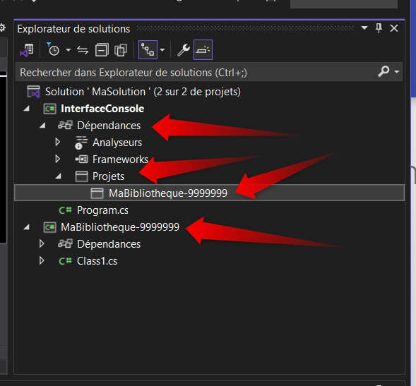

##
``` sh title="Program.cs" 
// En entete de fichier on doit maintenant faire le bon using

using MaBibliotheque-9999999; // le namespace dans lequel la ou les classe(s) se retrouvent.
```  