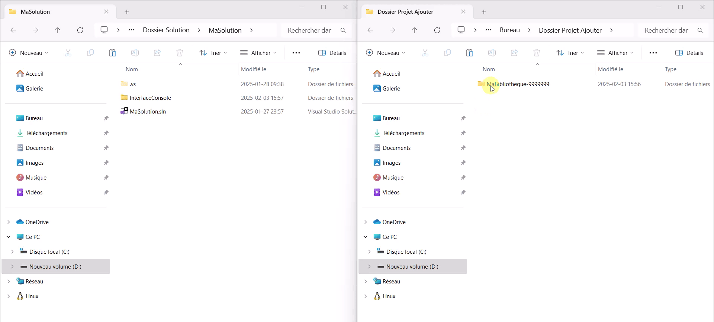
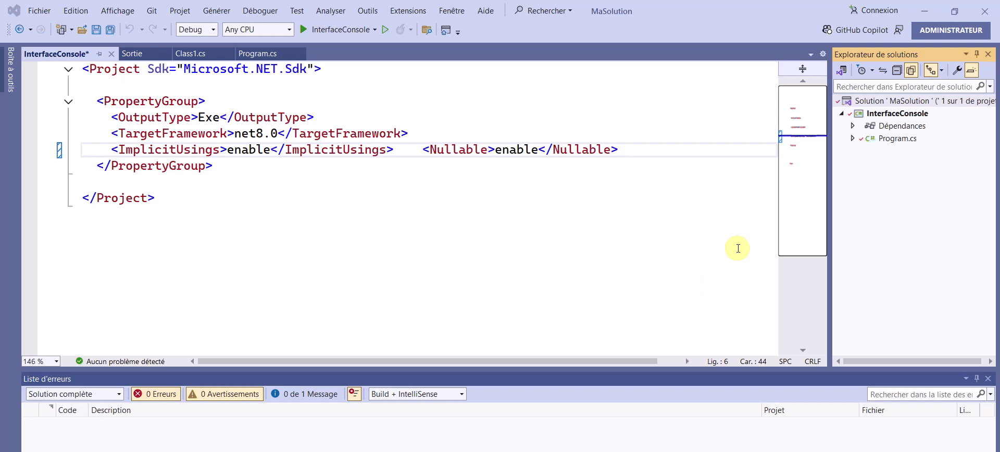
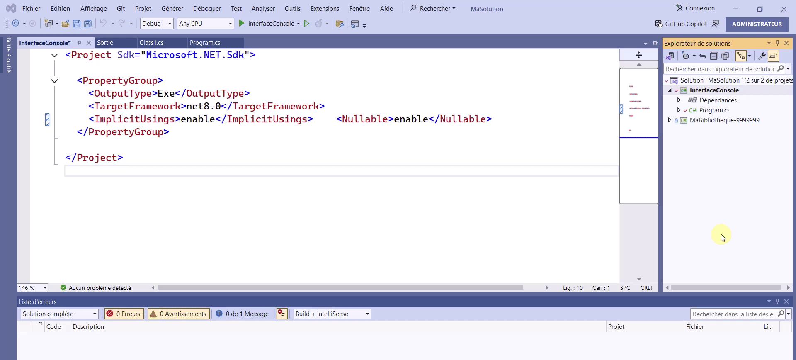
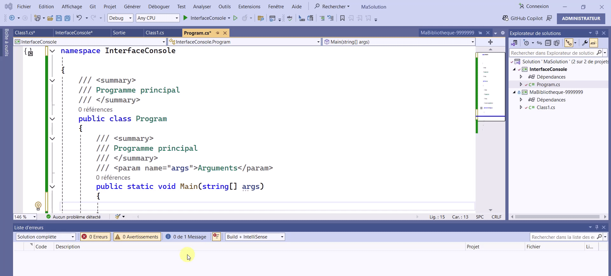

## Importation de projet dans une solution

### Ajouter le dossier du projet dans le dossier de solution  
  
### Ajouter le projet à la solution  
  
### Ajouter la dépendence entre les projets  
  
### Ajouter le "using" pour utiliser les classes dans l'autre espace de nom  
  

