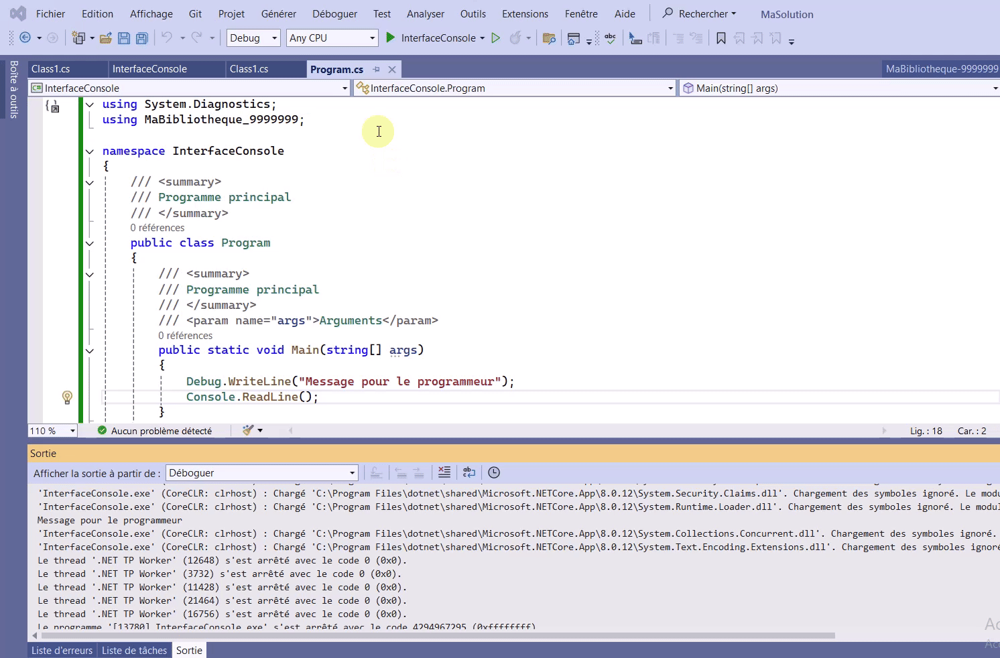
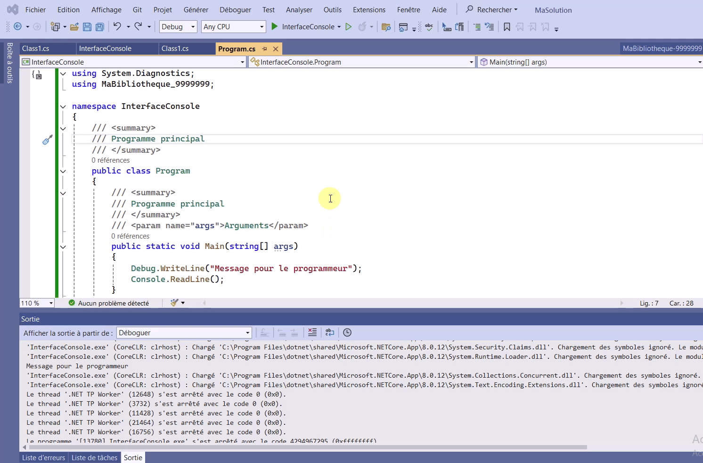

## Utilisation de Debug.WriteLine
- Activer la fenêtre de sortie  

- Je vous recommande de la mettre avec vos espions
- Toutes les fenêtres d'aide à l'exécution sont disponibles dans le menu Déboggage -> Fenêtres. 

  