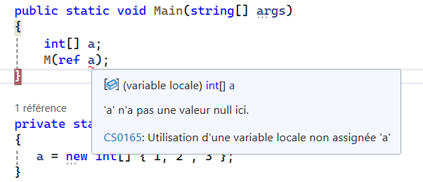

Passage par copie ou par référence ?

### Passage par copie 
En programmation, vous passez généralement vos variables à une méthode par copie.

Comme vu en classe, l'appel d'une méthode avec un paramètre de type int ne modifie pas la valeur de la variable dans la méthode Main(), et ce, même si les variables ont le même nom.
```csharp
public static void Main(string[] args)
{
    int a = 0;
    M(a);
    Console.WriteLine(a); // Ici, 'a' reste à 0.
}

public static void M(int a)
{
    a = 8;
}
```
La raison de ce comportement est que M() reçoit une copie de la valeur de a dans le programme principal.

Cependant, cela devient un peu plus complexe lorsque vous travaillez avec des tableaux ou des objets.
```csharp
public static void Main(string[] args)
{
    int[] a = {0, 1, 2, 3};
    M(a);
    Console.WriteLine(a[0]); // Ici, 'a[0]' sera 8.
}

public static void M(int[] a)
{
    a[0] = 8;
}
```
Dans cet exemple, ce que reçoit M() n'est pas une copie de la valeur de a, mais une copie de la référence. Cela signifie que la variable a dans Main() et la variable a dans M() font référence à la même zone mémoire. Par conséquent, lorsque a[0] est modifié dans M(), le tableau original dans Main() est directement affecté.

Voici un autre exemple pour illustrer le fait qu'il s'agit bien d'une copie de la référence, et non de la valeur :
```csharp
public static void Main(string[] args)
{
    int[] a = {0, 1, 2, 3};
    M(a);
    Console.WriteLine(a[0]); // Ici, 'a[0]' restera 0.
}

public static void M(int[] a)
{
    a = new int[10];  // 'a' est maintenant une nouvelle référence en mémoire.
    a[0] = 10;  // Modifie uniquement ce nouveau tableau.
}
```
Dans cet exemple, la variable a dans Main() ne sera pas modifiée. En effet, l'instruction new int[10] crée un nouveau tableau en mémoire, qui est référencé par a dans M(). Cette nouvelle référence n'affecte pas la variable a dans Main().
Passage par référence

### Passage par référence avec le mot ref.

Il est également possible de demander à une méthode de modifier directement le contenu d'une variable, à l'endroit même où elle est stockée en mémoire. Pour ce faire, il faut spécifier que la variable doit être passée par référence.

Le mot-clé **ref** permet de passer une variable par référence.
```csharp
public static void Main(string[] args)
{
    int a = 3;
    M(ref a); // L'appel se fait avec 'ref'
    Console.WriteLine(a); // Ici, 'a' sera 5.
}

public static void M(ref int a) // La déclaration de 'a' se fait également avec 'ref'
{
    a = 5;  // 'a' est modifié directement dans la méthode Main.
}
```
Dans cet exemple, la méthode M reçoit la référence en mémoire de a. Cela permet à M() de manipuler directement la valeur de a, et les modifications sont visibles dans la méthode Main().
Le mot-clé out

En C#, il existe également une autre façon de passer une variable par référence avec le mot-clé out.

Les mots-clés **ref** et **out** remplissent un rôle similaire, c'est-à-dire passer une variable par référence. La différence majeure réside dans le fait que **ref** nécessite que la variable soit initialisée avant l'appel de la méthode, tandis que **out** permet d'initialiser la variable directement dans la méthode appelée.

Cela vous rappelle-t-il quelque chose ?

### Passage par référence avec le mot clé out

Voici un exemple utilisant **out** avec Int.TryParse :
```csharp
public static void Main(string[] args)
{
    int a;  // Non initialisée
    bool test = int.TryParse("42", out a);  // 'a' sera initialisée ici.
    Console.WriteLine(a);  // Affichera 42.
}
```
Notez que la variable a doit être initialisée à l'intérieur de la méthode lorsque vous utilisez out.

De même, cela peut être appliqué aux tableaux et autres objets :
```csharp
public static void Main(string[] args)
{
    int[] a;  // Non initialisé
    M(out a);  // 'a' sera initialisé dans M().
}

private static void M(out int[] a)
{
    a = new int[] {1, 2, 3};  // Initialisation de 'a' dans M().
}
```

En revanche, essayer de faire la même chose avec **ref** provoquera une erreur de compilation, car **ref** exige que la variable soit déjà initialisée avant d'être passée à la méthode.  

  

Résumé

    - Passage par copie : La méthode reçoit une copie de la valeur de la variable.  
      Si la variable est un tableau ou un objet, la référence à cette mémoire est copiée,  
      ce qui permet de modifier les données, mais pas la référence elle-même.  

    - Passage par référence avec **ref** : Permet de modifier directement la variable  
      dans la méthode appelante. La variable est initialisée avant l'appel.  

    - Passage par référence avec **out** : Similaire à ref, mais la variable est  
      initialisée dans la méthode appelée. Vous ne pouvez pas l'utiliser sans l'initialiser dans la méthode.