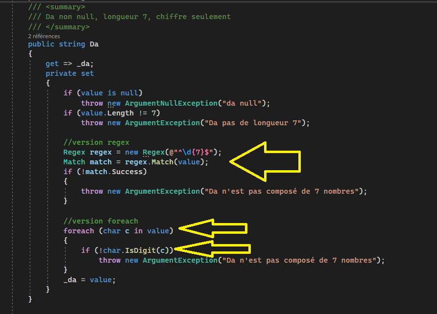

## Création d'une classe dans une bibliothèque  
- Lors de la création d'un projet de bibliothèque de classes, Visual Studio génère par défaut un fichier `Class1.cs` qu'il est fortement recommandé de renommer pour refléter l'utilité réelle de la classe.  
- Utilisez le raccourci de refactoring `Ctrl+R, Ctrl+R` directement sur le nom de la classe pour déclencher le renommage global.  
  
*Figure 1 : Utilisation du raccourci de renommage (Ctrl+R, Ctrl+R) pour assurer la cohérence dans tout le projet.*  

- Suite au changement de nom, accepte la proposition de Visual Studio de renommer également le fichier physique sur le disque.  
  
*Figure 2 : Boîte de dialogue confirmant la synchronisation du nom du fichier .cs avec celui de la classe.*  

## Création des champs / attributs  
- Déclarez vos variables membres (champs privés) en haut de la classe.  
- Respectez rigoureusement la convention C# : modificateur `private`, préfixe `_` et casse chameau (camelCase).  
  
*Figure 3 : Déclaration des champs privés (backing fields) servant à stocker l'état interne de l'objet de manière sécurisée.*  

## Accesseurs (Propriétés)  
- Pour exposer vos données tout en conservant le contrôle, générez des propriétés via les "Actions rapides" de Visual Studio.  
  
*Figure 4 : Accès au menu "Actions rapides et refactorisation" (Ctrl + .) en plaçant le curseur sur un champ.*  

- Sélectionnez l'option "Encapsuler le champ et utiliser la propriété" pour lier automatiquement votre champ privé à une propriété publique.  
  
*Figure 5 : Choix de l'encapsulation pour garantir que tout accès futur passera par la propriété.*  

- Effectuez un nettoyage du code généré pour en améliorer la lisibilité.  
- Les accesseurs `get` simples peuvent être condensés sur une seule ligne grâce à la syntaxe d'expression.  
  
*Figure 6 : Simplification visuelle des accesseurs pour un code plus compact et professionnel.*  

## Validation des valeurs passées dans les propriétés  
- Les sections de documentation XML (`
`) sont essentielles pour l'IntelliSense et la maintenance.  
- La logique de validation doit être placée dans le bloc `set` avant l'assignation au champ privé.  
- Rappel : le mot-clé `value` représente la donnée entrante que l'on tente d'assigner.  
  
*Figure 7 : Implémentation d'un garde-fou dans le `set` pour valider les données et lever une exception si nécessaire.*  

### Validation par regex et boucle  
- Pour des critères plus stricts (ex: format d'un numéro de DA), combinez les expressions régulières (`Regex`) et les boucles de vérification.  
  
*Figure 8 : Exemple de validation complexe traitant le format et le contenu spécifique d'une chaîne de caractères.*  

### Types nullables  
- Pour gérer proprement l'absence de valeur et éviter les avertissements de compilation, utilisez le modificateur nullable.  
- Ajoutez un `?` après le type (ex: `string?`) pour indiquer que la valeur peut être nulle.  
  
*Figure 9 : Définition d'un type nullable pour une gestion plus robuste des données optionnelles.*  

## Génération des constructeurs  
- Une fois vos validations en place, automatisez la création des constructeurs via les outils de refactorisation.  
- Appelez les "Actions rapides" directement sur le nom de la classe.  
  
*Figure 10 : Lancement de l'outil de génération automatique de constructeur.*  

- Sélectionnez l'option "Générer le constructeur..." dans le menu contextuel.  
  
*Figure 11 : Accès à la configuration des paramètres du nouveau constructeur.*  

- **Point crucial** : Cochez les **Propriétés** (casse majuscule) et non les champs privés (`_`). Cela force le passage par le `set` et donc l'exécution de vos validations lors de l'instanciation.  
  
*Figure 12 : Sélection des propriétés pour garantir l'intégrité des données dès la création de l'objet.*  

- Finalisez en complétant manuellement la documentation XML, particulièrement les balises `<exception>`, car elles ne sont pas générées automatiquement.  
  
*Figure 13 : Constructeur finalisé et documenté, prêt à être utilisé en toute sécurité par d'autres développeurs.*