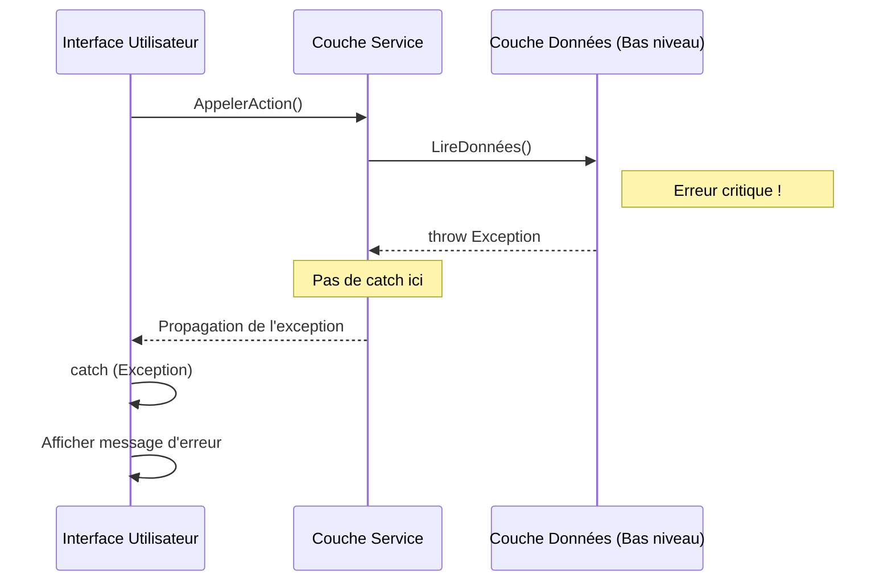
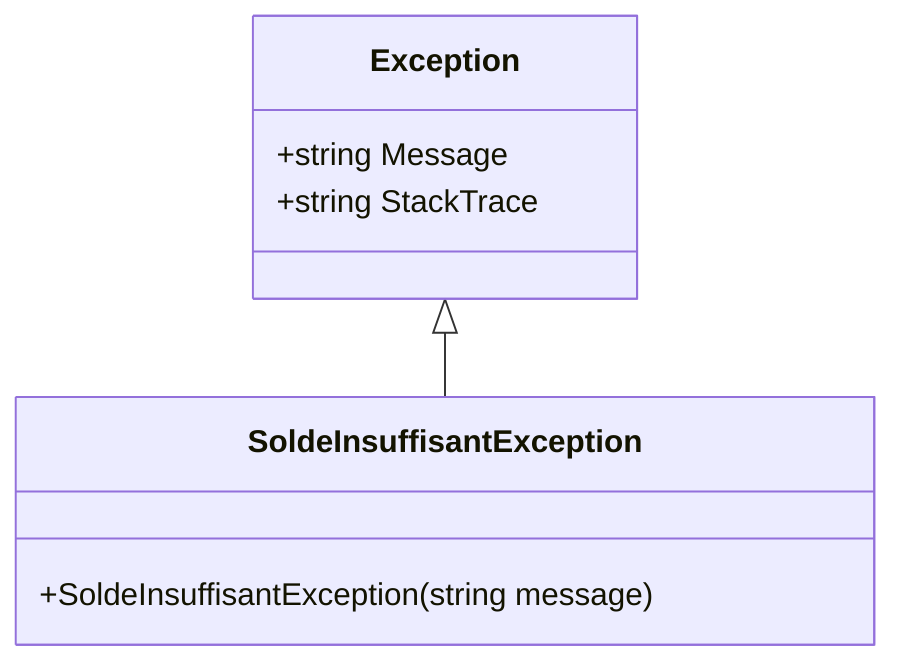

# Les exceptions en C#  

## 1. Introduction

Les exceptions en C# sont un mécanisme fondamental de gestion des erreurs à l’exécution.  
Elles permettent de **signaler une situation anormale**, de **séparer la logique métier du traitement des erreurs**, et d’**assurer la robustesse** d’une application.

Une exception représente un événement inattendu qui interrompt le flux normal d’exécution du programme.

---

## 2. Lever une exception

### 2.1 Principe général

En C#, une exception est levée à l’aide du mot-clé `throw`.

```csharp
throw new Exception("Une erreur est survenue.");
```

Lever une exception signifie :
- arrêter l’exécution normale du code courant,
- remonter l’erreur dans la pile d’appels jusqu’à un gestionnaire approprié (`catch`),
- ou provoquer l’arrêt du programme si elle n’est pas interceptée.



---

### 2.2 Lever une exception avec un message explicite

Il est recommandé de fournir un message **clair et orienté développeur**.

```csharp
if (age < 0)
{
    throw new ArgumentOutOfRangeException(nameof(age), "L'âge ne peut pas être négatif.");
}
```

Bonnes pratiques :
- expliquer **pourquoi** l’erreur se produit,
- indiquer **quel paramètre** est en cause,
- éviter les messages vagues.

---

### 2.3 Relancer une exception

Lorsqu’on intercepte une exception mais qu’on souhaite la propager :

```csharp
try
{
    TraitementCritique();
}
catch (Exception ex)
{
    // Log, nettoyage, etc.
    throw;
    //throw ex
}
```

⚠️ Toujours utiliser `throw;` et **pas** `throw ex;` afin de conserver la pile d’appels originale.

---

## 3. Quelles exceptions utiliser

### 3.1 Exceptions standards du framework

Le framework .NET fournit de nombreuses exceptions prêtes à l’emploi.  
Il est fortement recommandé de les utiliser plutôt que `Exception` directement.

| Exception | Cas d’utilisation |
|---------|------------------|
| `ArgumentException` | Argument invalide |
| `ArgumentNullException` | Argument null non autorisé |
| `ArgumentOutOfRangeException` | Valeur hors plage |
| `InvalidOperationException` | État de l’objet invalide |
| `NotSupportedException` | Fonctionnalité non supportée |
| `UnauthorizedAccessException` | Accès non autorisé |

Exemple :

```csharp
if (user == null)
{
    throw new ArgumentNullException(nameof(user));
}
```

---

### 3.2 Créer ses propres exceptions

Créer une exception personnalisée est pertinent lorsque :
- l’erreur fait partie du **domaine métier**,
- elle doit être identifiée clairement par les couches supérieures,
- elle apporte une valeur sémantique forte.

```csharp
public class SoldeInsuffisantException : Exception
{
    public SoldeInsuffisantException(string message) : base(message)
    {
    }
}
```



Usage :

```csharp
if (solde < montant)
{
    throw new SoldeInsuffisantException("Le solde du compte est insuffisant.");
}
```

Règle générale :  
👉 **Exception personnalisée = exception métier**, pas technique.

---

## 4. Quand laisser le système lever les exceptions

### 4.1 Ne pas intercepter inutilement

Il ne faut pas entourer chaque ligne de code d’un `try/catch`.  
Si une exception :
- est purement technique,
- ne peut pas être traitée localement,
- doit être remontée à un niveau supérieur,

alors **il vaut mieux laisser le système la lever naturellement**.

Exemple inutile :

```csharp
try
{
    int x = int.Parse(input);
}
catch (FormatException)
{
    throw;
}
```

---

### 4.2 Cas où le système fait mieux que nous

Certaines exceptions doivent être laissées telles quelles :
- `NullReferenceException`
- `IndexOutOfRangeException`
- `DivideByZeroException`

Ces exceptions indiquent souvent :
- une erreur de conception,
- un bug à corriger,
- un problème qui ne doit **pas** être masqué.

---

### 4.3 Où gérer les exceptions

En général :
- **Bas niveau** : on laisse remonter
- **Frontière applicative** (API, UI, service) : on intercepte, on log, on traduit

```csharp
try
{
    service.ExecuterCommande(cmd);
}
catch (SoldeInsuffisantException ex)
{
    return BadRequest(ex.Message);
}
catch (Exception ex)
{
    logger.LogError(ex, "Erreur inattendue");
    return StatusCode(500);
}
```

---

## 5. Bonnes pratiques récapitulatives

- Ne pas utiliser `Exception` par défaut  
- Lever des exceptions **exceptionnelles**, pas pour le contrôle de flux  
- Fournir des messages clairs et exploitables  
- Ne jamais masquer une exception sans raison    
- Gérer les exceptions aux **frontières du système**  
- Logger les erreurs critiques  

---

## 6. Conclusion

Les exceptions sont un outil puissant mais à manier avec discipline.    
Une bonne stratégie de gestion des exceptions améliore :  
- la lisibilité du code,  
- la maintenabilité,  
- la fiabilité globale de l’application.  

L’objectif n’est pas d’attraper toutes les erreurs, mais de **les gérer au bon endroit**.  

### 7. Références
Gestion et levée d’exceptions dans .NET  
<https://learn.microsoft.com/fr-fr/dotnet/standard/exceptions/>   
Meilleures pratiques pour les exceptions  
<https://learn.microsoft.com/fr-fr/dotnet/standard/exceptions/best-practices-for-exceptions>
