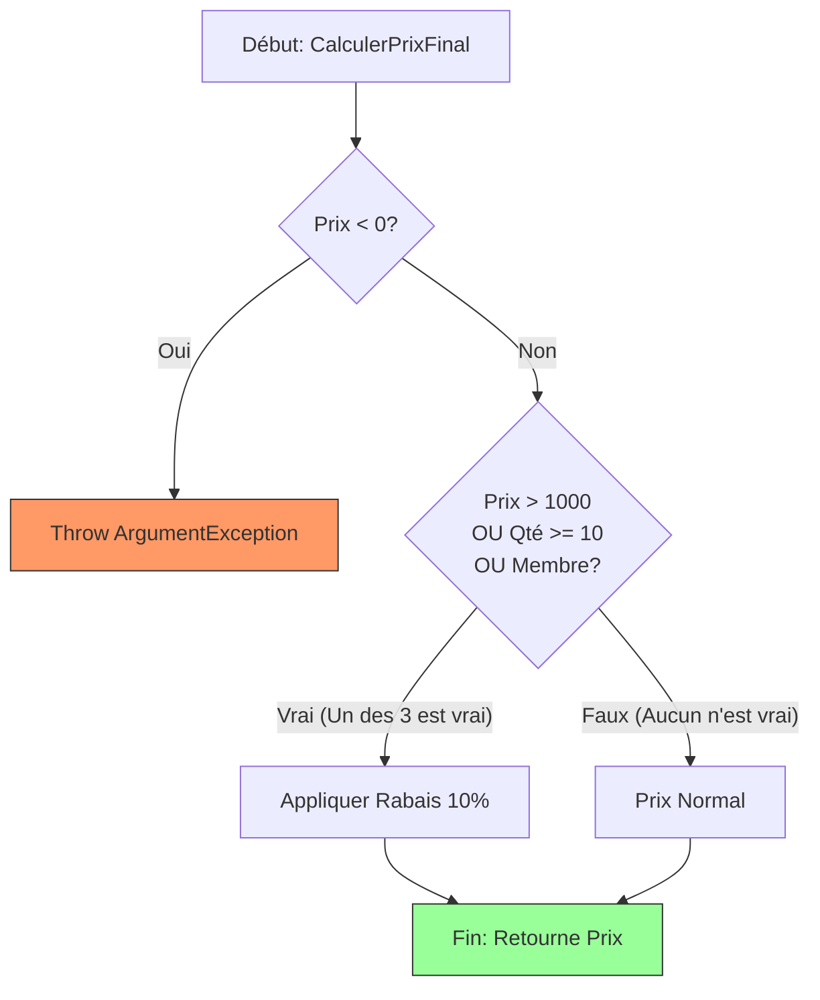

# Les Tests Unitaires avec MSTest

Les tests unitaires servent à valider de manière isolée le comportement d'une "unité" de code (généralement une méthode).

## 1. La Boîte à Outils : Les Asserts
L'objet `Assert` est le cœur du test. Il permet de comparer le résultat obtenu avec le résultat attendu.

| Méthode | Utilité |
| :--- | :--- |
| `Assert.AreEqual(attendu, actuel)` | Vérifie l'égalité des valeurs. |
| `Assert.IsTrue(condition)` | Vérifie que la condition est **Vraie**. |
| `Assert.IsNull(objet)` | Vérifie que l'objet est **Null**. |
| `CollectionAssert.AreEqual(col1, col2)` | Vérifie que deux listes ont les **mêmes éléments dans le même ordre**. |
| `CollectionAssert.AreEquivalent(col1, col2)` | Vérifie que deux listes ont les **mêmes éléments (peu importe l'ordre)**. |
| `CollectionAssert.Contains(col, item)` | Vérifie si un élément est présent dans la liste. |
| `Assert.ThrowsException<T>(() => ...)` | Vérifie qu'une méthode lance bien l'**exception de type T**. |

---

## 2. Structure d'un test : Le pattern AAA
Pour garder des tests lisibles, on utilise toujours la structure **AAA** :

1.  **Arranger** : On prépare les données et on instancie l'objet à tester.
2.  **Agir** : On appelle la méthode que l'on veut tester.
3.  **Affirmer** : On vérifie que le résultat est conforme à nos attentes.

---

## 3. Classe d'exemple : `MoteurPromotion`

```csharp
public class MoteurPromotion
{
    public List<string> Categories { get; } = new List<string> { "Électronique", "Mode" };

    /// <summary>
    /// Calcule le prix final après application des rabais potentiels.
    /// </summary>
    /// <param name="prix">Le prix unitaire initial.</param>
    /// <param name="quantite">La quantité d'articles.</param>
    /// <param name="estMembre">Vrai si le client est membre VIP.</param>
    /// <returns>Le prix final calculé.</returns>
    public double CalculerPrixFinal(double prix, int quantite, bool estMembre)
    {
        // Validation (Exception)
        if (prix < 0) throw new ArgumentException("Le prix ne peut être négatif.");

        // Logique combinée : Rabais de 10% si gros prix OU grosse quantité OU membre VIP
        if (prix > 1000 || quantite >= 10 || estMembre)
        {
            return prix * 0.90;
        }

        return prix;
    }
}
```

### Flux d'exécution (Points de sortie)


---

## 4. Évolution des Tests

### A. Test Simple (Le "Happy Path")
```csharp
    /// <summary>
    /// Vérifie qu'un prix standard sans condition de rabais reste inchangé.
    /// </summary>
    [TestMethod]
    public void CalculerPrixFinal_PrixStandard_RetourneMemePrix()
    {

    // Arranger
    var moteur = new MoteurPromotion();
    double prixInitial = 50;

    // Agir
    double resultat = moteur.CalculerPrixFinal(prixInitial, 1, false);

    // Affirmer
    Assert.AreEqual(prixInitial, resultat);
}
```

### B. Gérer les "Gonzillions" de tests (DataRow)
Quand une méthode a plusieurs conditions (`||`), on ne veut pas créer 10 méthodes de test identiques. On utilise le `[DataRow]` pour passer les valeurs et un nom de **scénario**.

```csharp
/// <summary>
/// Teste les différentes combinaisons de prix, quantité et statut de membre
/// pour valider l'application correcte des rabais de 10%.
/// </summary>
[TestMethod]

// Paramètres : (prixInitial, quantite, estMembre, prixAttendu, nomScenario)
[DataRow(1200, 1, false, 1080.0, "Rabais : Prix > 1000")]
[DataRow(100, 15, false, 90.0, "Rabais : Quantité >= 10")]
[DataRow(100, 1, true, 90.0, "Rabais : Membre VIP")]
[DataRow(500, 2, false, 500.0, "Aucun rabais : Conditions non remplies")]
public void CalculerPrixFinal_Combinaisons_RetournePrixAttendu(
    double prixInitial, int quantite, bool estMembre, 
    double prixAttendu, string nomScenario)
{
    // Arranger
    var moteur = new MoteurPromotion();

    // Agir
    double prixActuel = moteur.CalculerPrixFinal(prixInitial, quantite, estMembre);

    // Affirmer (avec message de débogage riche)
    Assert.AreEqual(prixAttendu, prixActuel, 
        $"\nÉCHEC SCÉNARIO : {nomScenario}\n" +
        $"Données : [Prix: {prixInitial}, Qté: {quantite}, Membre: {estMembre}]\n" +
        $"Attendu: {prixAttendu}, Reçu: {prixActuel}");
}
```

---

## 5. Tester les Exceptions et leurs Messages

Il est crucial de tester que le code "casse" correctement. On utilise `Assert.ThrowsException` pour capturer l'exception et vérifier son message.

```csharp
/// <summary>
/// Valide qu'un prix négatif provoque une ArgumentException avec un message explicatif.
/// </summary>
[TestMethod]
public void CalculerPrixFinal_PrixNegatif_LanceArgumentExceptionAvecMessage()
{
    // Arranger
    var moteur = new MoteurPromotion();
    double prixNegatif = -10;

    // Agir & Affirmer
    // 1. On vérifie que ça lance la bonne exception
    var ex = Assert.ThrowsException<ArgumentException>(() => 
        moteur.CalculerPrixFinal(prixNegatif, 1, false)
    );

    // 2. On valide le message à l'intérieur pour être sûr de la raison
    StringAssert.Contains(ex.Message, "ne peut être négatif", 
        $"L'exception aurait dû mentionner la raison. Message reçu : {ex.Message}");
}
```

> **Note :** On préfère `Assert.ThrowsException` à l'ancien attribut `[ExpectedException]` car cela permet de faire des affirmations supplémentaires sur l'objet d'exception lui-même (comme vérifier le message).

---

## 6. Tester les Collections

Quand une méthode retourne une liste ou qu'une propriété contient une collection, on utilise `CollectionAssert`.

```csharp
/// <summary>
/// Vérifie que la liste des catégories est correctement initialisée par défaut.
/// </summary>
[TestMethod]
public void Categories_AuDemarrage_ContientLesCategoriesParDefaut()
{
    // Arranger
    var moteur = new MoteurPromotion();
    var attendu = new List<string> { "Électronique", "Mode" };

    // Agir
    var actuel = moteur.Categories;

    // Affirmer
    
    // 1. Vérifie l'ordre exact et le contenu
    CollectionAssert.AreEqual(attendu, actuel, 
        "La liste des catégories ne correspond pas à l'ordre attendu.");

    // 2. Vérifie la présence d'un élément spécifique
    CollectionAssert.Contains(actuel, "Mode", 
        "La catégorie 'Mode' devrait être présente.");
}
```

> **Astuce :** Si l'ordre n'est pas important pour votre test, utilisez `CollectionAssert.AreEquivalent`. Elle s'assurera que les deux listes ont les mêmes éléments, peu importe où ils se trouvent dans la liste.